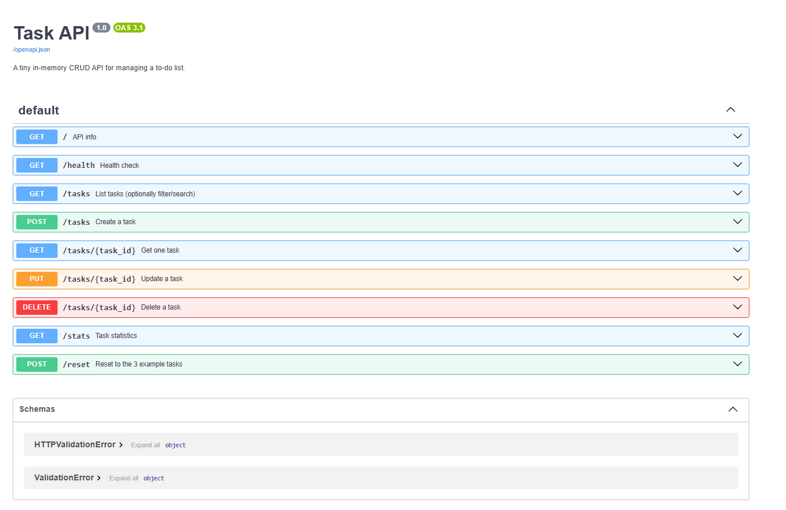
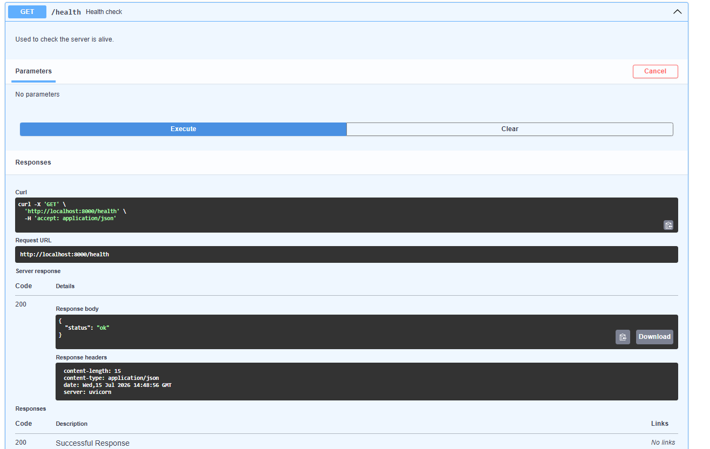
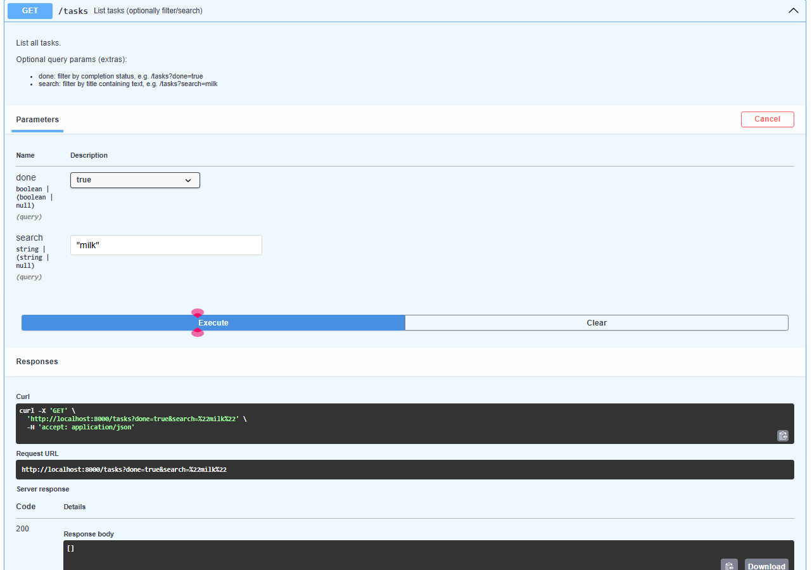
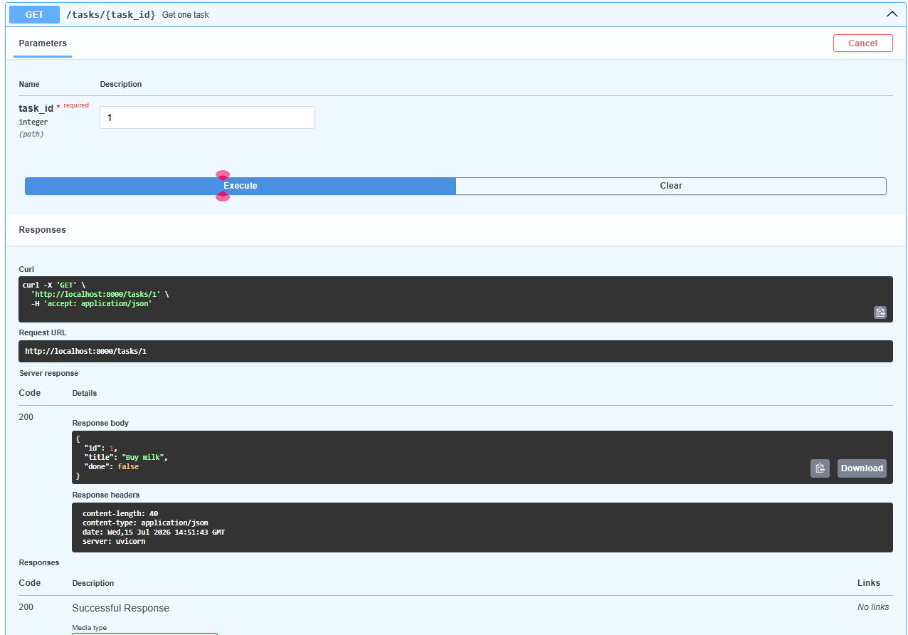
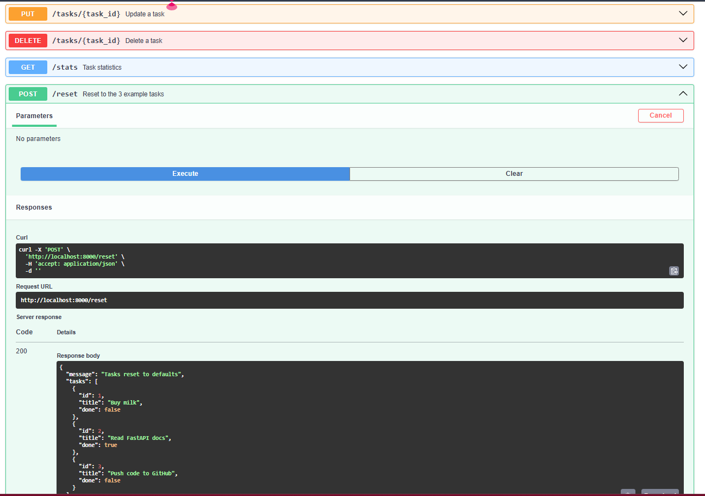

# Task API — a small in-memory CRUD API

A tiny backend built with **Python + FastAPI** that manages a to-do list.
Built as part of Week 2 — Build your first CRUD API (BE-01).

## What this is

A REST API with full CRUD (Create, Read, Update, Delete) on an in-memory
list of tasks. No database yet — data resets when the server restarts
(that's intentional for this stage).

## How to run it

```bash
pip install -r requirements.txt
uvicorn main:app --reload --port 8000
```

Then open:
- http://localhost:8000/ — API info
- http://localhost:8000/health — health check
- http://localhost:8000/docs — Swagger UI (interactive docs)

## Endpoints

| Method | Path          | Description                          | Success | Errors |
|--------|---------------|---------------------------------------|---------|--------|
| GET    | `/`           | API info                              | 200     | —      |
| GET    | `/health`     | Health check                          | 200     | —      |
| GET    | `/tasks`      | List all tasks (supports `?done=` and `?search=`) | 200 | — |
| GET    | `/tasks/{id}` | Get one task                          | 200     | 404    |
| POST   | `/tasks`      | Create a task (`{"title": "..."}`)    | 201     | 400    |
| PUT    | `/tasks/{id}` | Update a task's `title` and/or `done` | 200     | 400, 404 |
| DELETE | `/tasks/{id}` | Delete a task                         | 204     | 404    |
| GET    | `/stats`      | Extra: `{total, done, open}`          | 200     | —      |
| POST   | `/reset`      | Extra: reset to the 3 example tasks   | 200     | —      |

## Example curl output

```
$ curl -i -X POST http://localhost:8000/tasks -H "Content-Type: application/json" -d '{"title":"Buy milk"}'

HTTP/1.1 201 Created
content-type: application/json

{"id":4,"title":"Buy milk","done":false}
```

```
$ curl -i http://localhost:8000/tasks/99

HTTP/1.1 404 Not Found
content-type: application/json

{"detail":"Task 99 not found"}
```

## Swagger UI

*(Screenshot goes here — open http://localhost:8000/docs, 

## S1



## S2



## S3



## S4



## S5




## The mortality experiment

*(Fill in after you restart the server and hit GET /tasks:)*
Because tasks live only in a Python list in memory, restarting the
server wipes them back to the 3 default tasks — anything created,
updated, or deleted during the previous run is gone. This is why
persistent storage (a real database) matters, which is the topic for
Week 3.

## AI vs me (Stage 7 — bonus, optional)

*(If you do Stage 7: write your own prompt from memory, generate the
AI's version in a separate `ai-version/` folder, run it against the
same checkpoint curls, diff it against this code with
`git diff --no-index`, and answer the three questions from the
assignment here.)*
